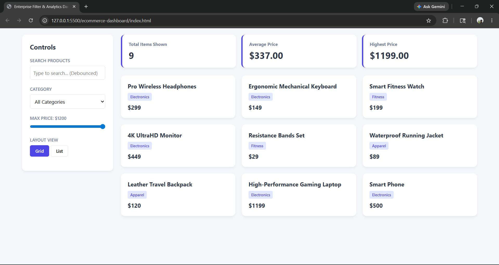

# Enterprise E-Commerce Analytics Dashboard

[]([https://golden-zabaione-d0115a.netlify.app/])

A responsive, performance-optimized e-commerce product catalog and analytics dashboard built entirely with vanilla web technologies. This project demonstrates advanced DOM manipulation, state management, and algorithmic data filtering without the use of external frameworks.

 
*(Note: Ensure you add a screenshot.png to your folder for this to display)*

## 🚀 Live Demo
[Click here to view the live deployment on Netlify]([(https://golden-zabaione-d0115a.netlify.app/])

## 💡 Key Features

* **Real-Time Data Filtering:** Multi-criteria filtering allows users to sort products by search terms, category, and price simultaneously.
* **Debounced Search:** Implemented a custom debounce function on the search input to limit function calls, drastically improving performance when typing.
* **Dynamic Analytics:** Calculates and updates total items, average price, and highest price on the fly using array reduction methods (`.reduce()`).
* **UI State Management:** Seamlessly toggles between CSS Grid (card view) and Flexbox (list view) layouts without reloading the page or duplicating DOM elements.

## 🛠️ Tech Stack

* **HTML5:** Semantic markup for accessibility and structure.
* **CSS3:** Custom CSS variables for theming, CSS Grid for the product layout, and Flexbox for component alignment.
* **Vanilla JavaScript (ES6+):** Utilizes arrow functions, object destructuring, higher-order array methods (`.map()`, `.filter()`, `.reduce()`), and modular state objects.

## 🧠 Technical Learnings

Building this project reinforced several core engineering concepts:
1. **State Centralization:** Managing a single `state` object (holding active filters and view modes) is vastly superior to pulling values directly from the DOM on every user interaction.
2. **Performance Optimization:** Writing a debounce utility function from scratch highlighted the importance of controlling the frequency of expensive operations (like DOM updates and data mapping).
3. **Data-to-UI Synchronization:** Separating the data logic (`filterData`, `calculateMetrics`) from the rendering logic (`renderUI`) keeps the codebase modular and easier to scale.

## ⚙️ How to Run Locally

1. Clone the repository:
```bash
   git clone []
